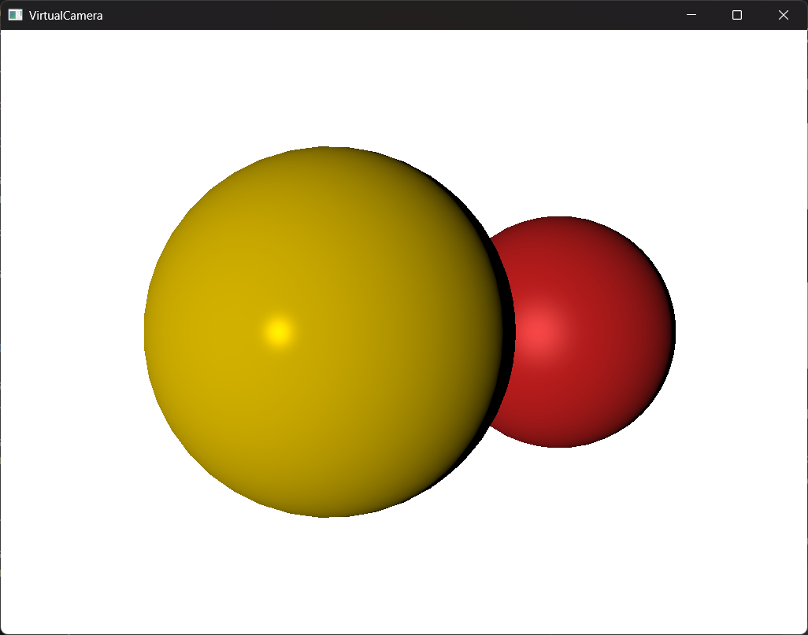
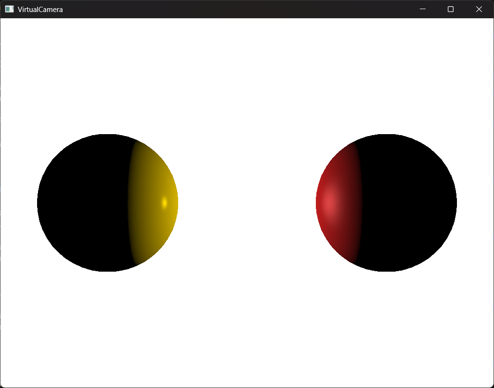

# Virtual Camera

A simple 3D software renderer written in C++.


## Key Features

- Software rasterization pipeline written in C++ 20.
- Camera control with full 3D translation, rotation, and zoom.
- Scene defined using triangle-based B-rep models.
- Reverse z-buffer and back-face culling for visibility determination.
- Phong reflection model with material support.

## Description

Virtual Camera is a software rasterizer I developed during my Computer Graphics
course in Warsaw University of Technology. It is my attempt to implement a modern
computer graphics pipeline without the use of external 3D graphics APIs such as
OpenGL, Vulkan, DirectX, or Metal.

It features a camera which can be manipulated within a predefined scene.
The scene consists of two spheres (approximated by subdividing icosahedrons)
assigned gold and red plastic materials, although any B-rep models defined
by triangular faces could be rendered. Earlier versions included
pyramids and cubes.

The renderer transforms the 3D geometry into 2D screen space using homogeneous
coordinates and matrix-based transformations, including translation, rotation,
perspective projection.

For visibility determination, it uses a reverse z-buffer to resolve depth and
correctly handle occlusion between objects. Back-face culling is also implemented
to skip rendering faces not visible to the camera, improving performance.


*Spheres occluding each other*

Local illumination is computed using the Phong reflection model. Each object in the
scene has an associated material that defines how it reflects light, resulting
in visually distinct shading based on material properties.


*Spheres with different local lighting depending on material*

## Getting Started

### Prerequisites

- C++ 20 compiler
- CMake 3.27 or newer
- Git
- Ninja

### Installation

This repository stores third-party libraries in Git submodules, which means
cloning it requires some special care.

Perform recursive cloning using

```sh
git clone --recurse-submodules https://github.com/michalciechan/VirtualCamera
```

### Building

First generate build configuration using CMake, assuming your current directory
is inside the project's root.

```sh
cmake -S . -B build --preset default
```

Building the project is done with the following command.

```sh
cmake --build build --target VirtualCamera --preset debug
```

Or, for an optimized executable.

```sh
cmake --build build --target VirtualCamera --preset release
```

### Usage

The compiled executable can be run as is.

```sh
./VirtualCamera.exe
```

Once running, you can interact with the camera and light using the following
keys:

- `W`, `A`, `S`, `D`, Ctrl, Space - move the camera.
- Arrow keys, `Q`, `E` - rotate the camera.
- `+`, `-` - zoom in and out.
- Numpad `4`, `6` - move the light.

## Known issues and limitations

- No dynamic model loading – the scene is hardcoded in the source; models
cannot currently be imported from external files.
- No global illumination – only local lighting is supported via the Phong model.
Objects do not cast shadows on each other, and effects like indirect lighting
or ambient occlusion are not present.
- No texture mapping – surfaces are shaded purely based on material properties,
without support for image-based textures.

## License

This project is distributed under the MIT license. See `LICENSE` for more information.

## Authors

Michał Ciechan - [https://github.com/michalciechan](https://github.com/michalciechan)
